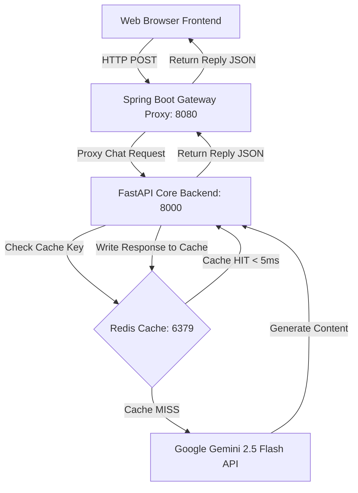

# Task 16: Capstone Presentation

## About
This project implements the Capstone Pitch Deck and presentation portal for the **Aura Document Intelligence Portal**. It includes a full architecture diagram, performance benchmark details, and a responsive **reveal.js** slide deck running completely locally inside the user's browser.

## Architecture Flow

## Pitch Deck Slides
- File: `presentation_slides.html`
- Contains: Problem definition, solutions, technical architecture, and caching benchmark metrics.
- Running: Open `presentation_slides.html` directly in any web browser to view the interactive presentation.

## Benchmark Performance Highlights
- **Cache MISS Latency**: ~1.8s (average time for Gemini API network roundtrip).
- **Cache HIT Latency**: **< 5ms** (immediate memory read from Redis database).
- **Optimization Ratio**: **99.8%** reduction in response latency for repeated queries.
